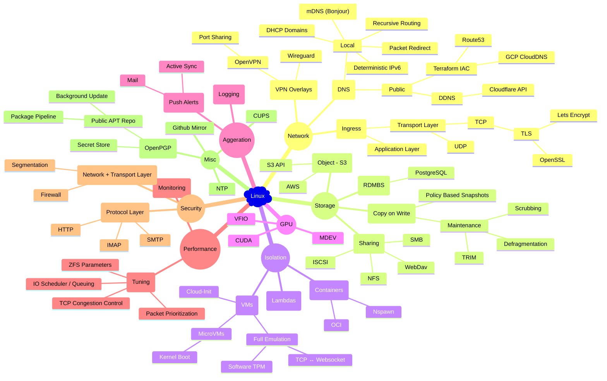
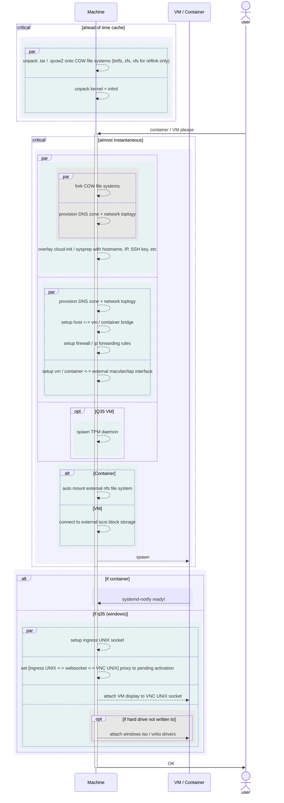

# Cloud Replica

Because it's ~~cool~~ yours.

## Motivation

There are many reasons to choose a public cloud provider; economies of scale inherently favor the aggregation of both hardware and expertise. As a matter of fact, commodity hardware is comparatively inexpensive relative to the know-how required to operate it ably. It is also true that for incumbent cloud operators, the accumulation of expertise is crystallized in software, meaning that the marginal cost of expanding operations is much lower than that of up-and-coming aspirants.

Owing to their less established position, consumers who rent from public cloud providers often encounter practices resembling rent seeking. A prime example is the excessive charges for data egress, which serve as a clear tactic for both inflating prices and fostering a form of compelled loyalty among customers.

## Freeloading

Luckily, aversion towards indentured tenancy is not limited to those feeble masses lacking the necessary means to build their replica cloud, but is shared among the tech behemoths who operate internal clouds. Even more fortunate is the fact that these giants frequently up-stream the underlying components of their private clouds into the open Linux ecosystem; a strategic move which externalizes much of the maintenance cost.

Nevertheless, it requires a significant level of expertise to intricately weave these disparate components together into an efficient, and maintainable private cloud infrastructure. The ensuing exposition offers a high-level overview of such a process.

## Partial Breakdown of Components

## Standing on Top of ~~Facebook~~ Meta's Container Platform

Since Meta is not leveraging its internal infrastructure for profit, their engineers are at liberty to not only back-propagate their labour into the Linux ecosystem, but to also dole out occasional implementation details. From reverse engineering of open source information, it appears that Meta has heavily invested in the Systemd service daemon. In particular its container runtime is based on Systemd-Nspawn and, at some point, Meta had adopted BTRFS as its backing Copy on Write (CoW) storage for many of its VMs and containers.

While the current platform's design mirrors some of the principles behind Systemd-Nspawn, it's not a clean room implementation of Meta's stack. Instead, it makes the crucial decision to trade scalability for flexibility and maintainability.

## Partially Containerized Services

The cloud replica runtime is a collection of services, and service composition is made amenable via partial containerzation: Using Systemd to enforce a more granular application of Linux kernel and user-space sandboxing than that of OCI (Docker) containers.

### Orthogonality: Ensuring independence of service environments

- **Immutable root**: Instead of pulling in numerous images of Linux user space, service processes are prevented from modifying the root file system. This serves to make the root file system analogous to a shared base image in OCI containers.

- **Transient environment**: Service processes are granted write privileges to clean slate temporary file systems, for both inter-process communication (IPC) and caching.

- **Isolated network**: Service processes are spawned under their own network namespace if necessary, with a loopback proxy straddling the host ↔ private network namespaces. To reduce overhead, this is performed as a last resort with UNIX sockets being the preferred IPC mechanism.

### Standardization: Ensuring generality of service interfaces

- **Consistent logging**: Service logs are redirected to standard file descriptors, and syslog sockets, which are then aggregated by the host journal. This is, in turn, centralized by a unified journaling service.

- **Configuration overlay**: Instead of overriding service configuration in place, service configuration files are mounted as read-only overlays. By doing so, maintaining the read-only root and making it trivial to roll-back to original configuration.

- **State shift**: Using mount namespaces, service states are transparently shifted onto a CoW file system, which is governed by snapshot policies. This allows for constant time, crash consistent, and deduplicated backups.

### Logistics: Ensuring delivery of service dependencies

- **Consistent deployment**: Service dependencies are resolved by the native package manager and only the native package manager.

- **Native overlay**: Instead of OCI tarballs, a daily build + distribution CI pipeline is maintained for the native package format which is then overlaid via the package manager onto the read-only root file system.

## Template Service Sets: Containers / VMs

Due to the relative complexity of these execution environments, a composition of concurrent services is necessary and a grouping of aforementioned containerized base services into service sets is performed. To lessen the surface area, a facade is then constructed in the form of a template service which, when instantiated, will spawn the necessary set of services.

See fig. 2 in the addendum for a high level overview of the concurrent execution flow.

## Result and The Future

With a robust set of building primitives, the cloud replica is able to cover a wide variety of functions: PostgreSQL IaC, CUDA enabled containers, instantaneous VMs with TPMs, live alerts with Active Sync, dual VPN gateways, multiprotocol authentication proxies and so on. This is possible precisely because it externalizes much of the complexity and maintenance cost onto the billion dollar Linux ecosystem.

Having an extremely limited set of developer resources (i.e. my free time) the replica project would also not be possible without the religious zeal by which the Linux community ensures backwards compatibility.

Unfortunately, with the increasing popularization of "move fast and break things" programming, more and more future software will incur an unsustainable maintenance burden.

## Why not Kubernetes?

Kubernetes, born from Google's internal orchestration systems, reigns over the cloud-agnostic landscape with its widespread adoption, expansive ecosystem, and rapidly evolving feature set. However, under the stewardship of CNCF, Kubernetes has cultivated an ethos of "move fast and depreciate things", resulting in anemic support cycles which favour new capabilities over backward compatibility (the exact set of tradeoffs which makes Kubernetes hosted on public cloud attractive). For smaller operations, maintaining a Kubernetes environment can become an arduous endeavour lacking these economies of scale.

Moreover, at the runtime level, whether employing Docker or Containerd, Kubernetes delegates significant multi-tenancy responsibilities to the Linux service daemon in Systemd. When viewed through the lens of service daemons, Kubernetes makes for an expensive abstraction over Systemd, especially at the single node level.

---

### Addendum

fig. 2

