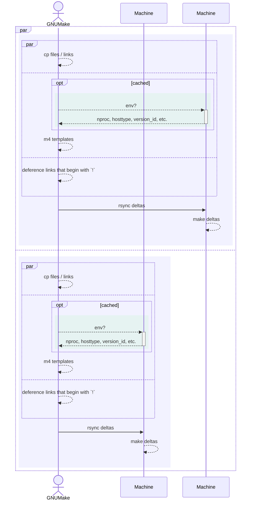

# DX

## 100ms iterations + minimal maintenance

Classic UNIX tools

- Brutally **ossified** → religiously forward compatible

- Brutally **quick** → benefitted from decades of hardware advancement

- Brutally **textual** + **recursive** → UNIX is made of text & recursive process trees

### Tech Stack

- bash, awk, jq, etc. : **mostest high level** languages

- make : recursive macros, embarrassingly **parallel**, **incremental** builds

- m4 : POSIX templating (no built-in loops, only recursion)

- rsync : timestamps based delta → `make` : timestamp based delta

### High Level Language

What is the building block?

#### Haskell?

Functions

```haskell
functions . pointfree . compose
```

#### Bash

Programs

```bash
program | program | program
```

### Isn't Bash unmainainable?

Litmus test: Are you able to write a recursive HTTP server in bash?

- Yes → `continue`

- No → [checkout my talk](https://github.com/ms-jpq/defcon604-2023/tree/main)

## Idempotent deployments + rollback

Pretend we have an immutable server, except for `/usr/local/*`

### Configuration → Behavior

Where do service configurations live? → `/etc/*`

- UNIX `HIER` → Override `/etc/*` via `/usr/local/*` where possible

- `systemd` bind mount `/usr/local/*` into `/etc/*` where needed (`systemd` conf also under `/usr/local/*`)

Hard reset: `rm -fr -- /usr/local/*`

## Everything everywhere, at once

- Incremental & Parallel

- Local make → SSH pipe lining → Remote make


