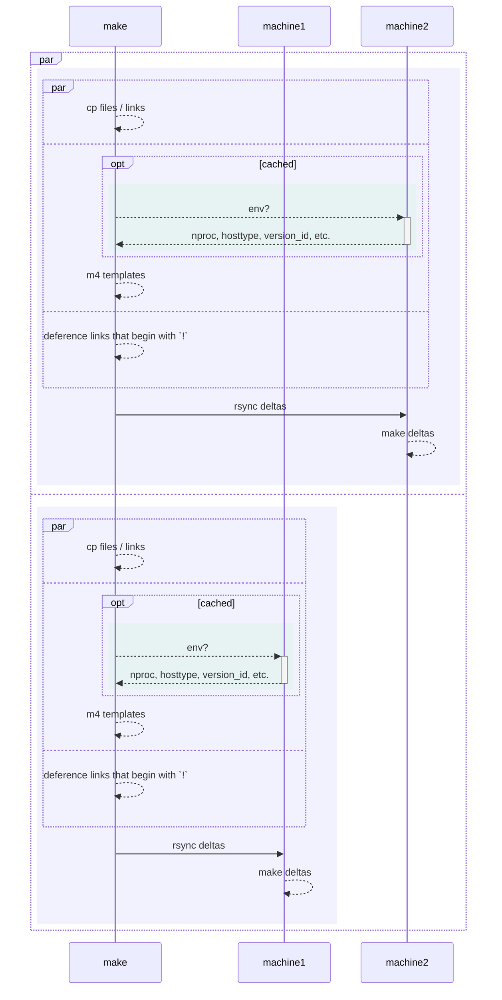

# DX

## 100ms iterations + minimal maintenance

Classic UNIX tools

- Brutally fast → decades of hardware advancement

- Brutally ossified → perpetual forward compatible

- Brutally textual + recursion heavy → UNIX is made of text & process trees

### Tech Stack

- bash, awk, jq, etc. : mostest high level languages

- make : recursive macros, embarrassingly parallel, incremental builds

- m4 : POSIX templating (no built-in loops, only recursion)

- rsync : timestamps based delta → `make` : timestamp based delta

### High Level Language

What is the building block?

#### Haskell?

Functions

```haskell
functions . pointfree . compose
```

#### Bash

Programs

```bash
program | program | program
```

### Isn't Bash unmainainable?

Litmus test: Can you write a recursive HTTP server in bash?

- Yes → `continue`

- No → [read my talk](https://github.com/ms-jpq/defcon604-2023/tree/main)

## Idempotent deployments + rollback

Pretend we have an immutable server, save for `/usr/local/*`

### Where do programs derive their behavior?

Where do configurations live? → `/etc/*`

- UNIX `HIER` → Override `/etc/*` via `/usr/local/*` where possible

- `systemd` bind mounts where needed (also go under `/usr/local/*`)

Rollback: `rm -fr -- /usr/local/*` + reload

## Everything everywhere, at once

- Incremental & Parallel

- Local make → SSH pipe lining → Remote make


