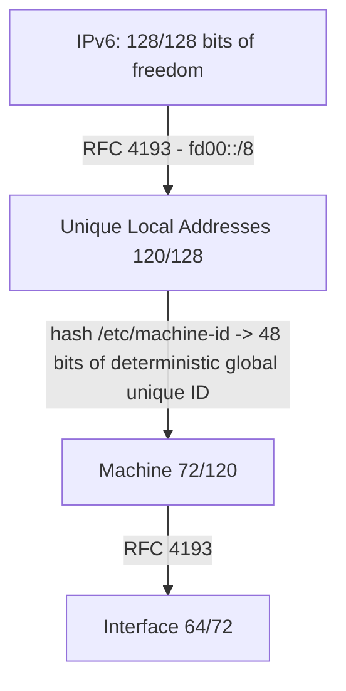

# Network Design

- IPv6: ULA - `120/128` bits of freedom

- IPv4: Private ranges - `{24,20,16}/32` bits of freedom

## IPv6

```mermaid
flowchart TD
  ipv6["IPv6: 128/128 bits of freedom"]
  ula["Unique Local Addresses 120/128"]
  mach["Machine 72/120"]
  if["Interface 64/72"]

  ipv6 -- "RFC 4193 - fd00::/8" --> ula
  ula -- "hash /etc/machine-id -> 48 bits of deterministic global unique ID" --> mach
  mach -- "RFC 4193" --> if
```

