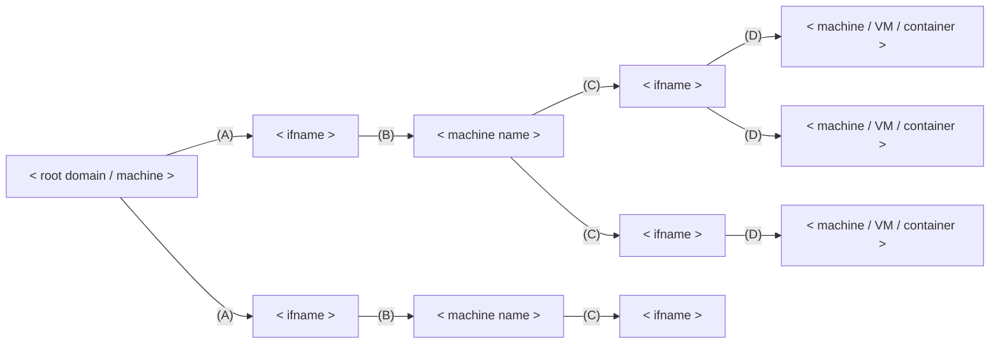
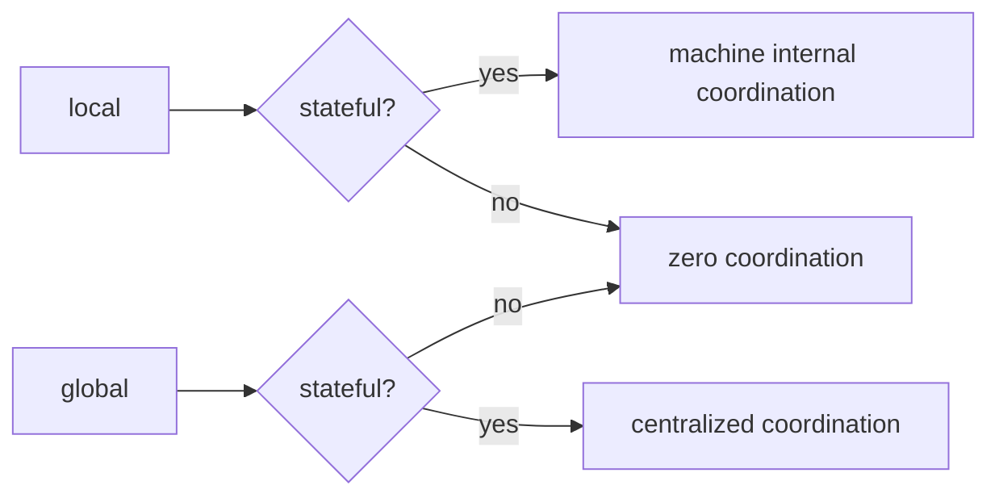
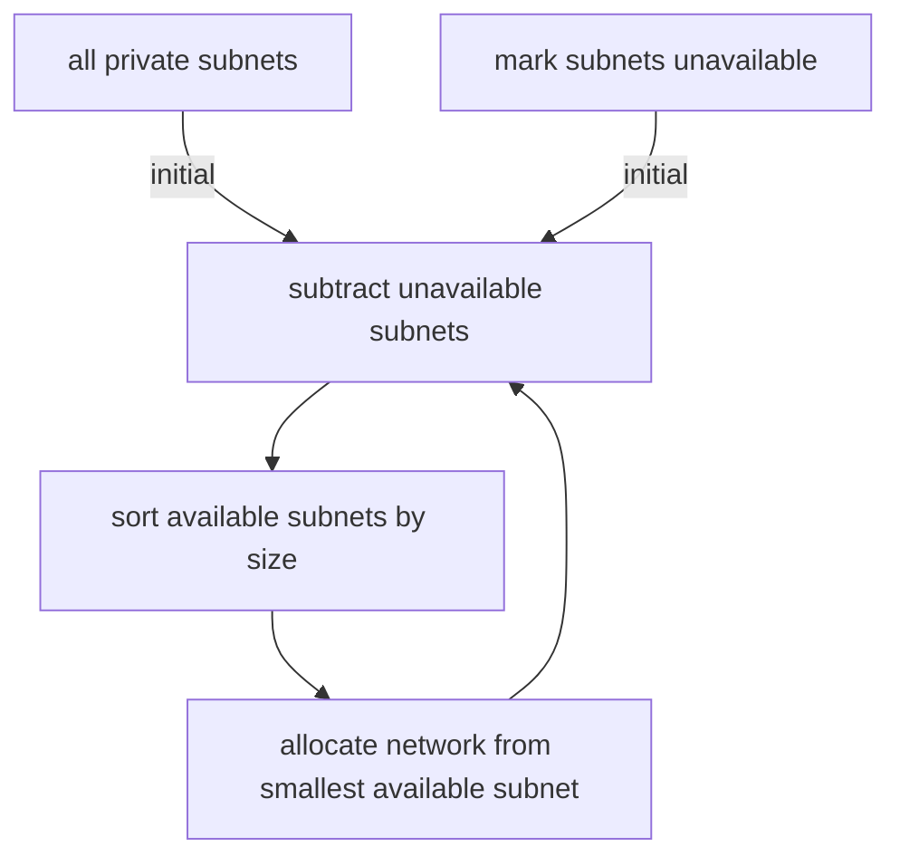

# Network Design

## DNS

- Machines are responsible for DNS queries on their subdomains, recursively.

- i.e. Root machines are queried for **`[A -> B]`**, next level machines are queried for **`[C -> D]`**, and so so.

## IP allocations

- Zero coordination: Globally unique addresses, trivially routable DNS → IP.

- Internal coordination: Machine level locking, machines handle DNS → IP translation via `DHCP` leases.

- Centralized coordination: IPv4 partitioning mechanism.

### IPv6

ULA - `120/128` bits of freedom, enough bytes for **globally unique deterministic hashing** → BLAKE3

- `48` bits for machine-id derived **globally unique** subnet (upper `fd**:****:****:****::/56`)

- `64` bits for machine-id derived **globally unique** `SLAAC` address suffix (lower `::****:****:****:****/64`)

- `16` bits left for machine local interfaces (sequential ID), **deterministically ordered** via `udev` naming scheme for "physical" interfaces and first come, first served for virtual interfaces

Stateless global topology.

Stateless `host` → `VM / container` topology, since `host` has prior knowledge of `VM / container` ID as hash inputs.

### IPv4

Private ranges - `{24,20,16}/32` bits of freedom, insufficient entropy for stateless solutions.

## Overlay Network

WireGuard gateways
