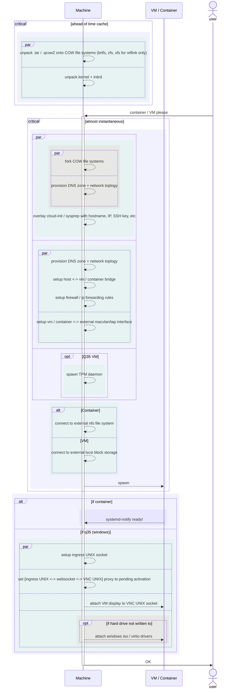
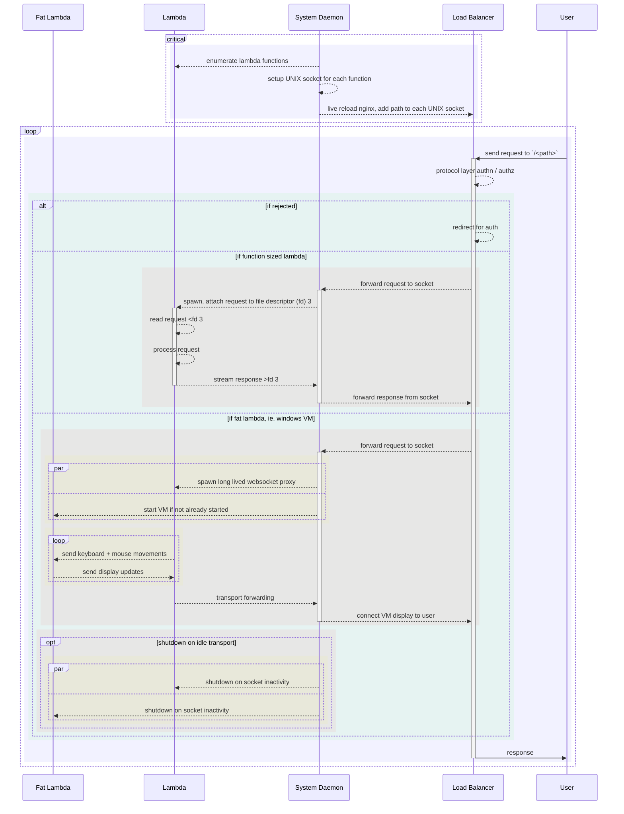

# Private Cloud

- Nspawn containers

- Qemu MicroVM / Q35

## Sub-second VM / Containers

- "Daemonless" `systemd` services (in the podman sense)

- Concurrent initialization

## Scale to zero + network activation

- Network socket activated services

- Shutdown on idle

