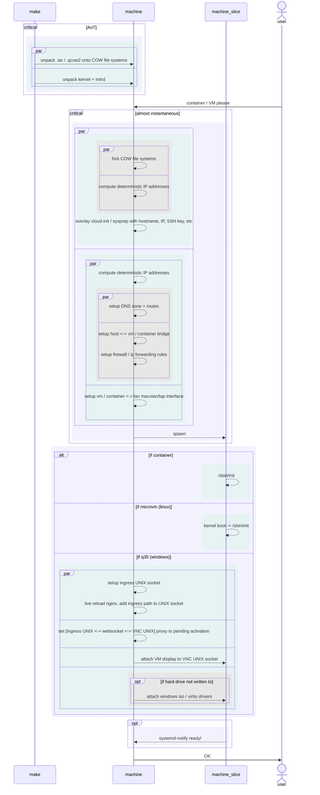
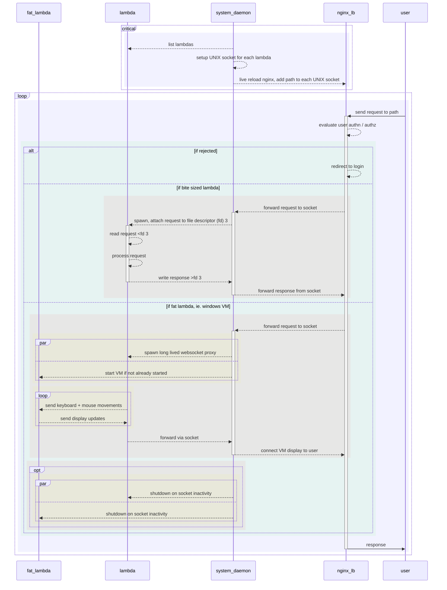

# My Hybrid Cloud

Welcome to my pet cloud.

## Design Goals

### DX

- [x] 100ms max iteration time

- [x] Idempotent deployment + instant rollback

- [?] Minimum maintenance, 10 year LTS

- [x] Daily + continuous CI builds

## Cloudy

- [x] Sub-second VM / Container spin up/down

- [x] Scale to zero lambdas / VM / containers

- [x] Overlay networks + DNS service discovery

- [x] GPU (CUDA) access in VM / containers

- [x] SSO

- [x] Centralized alerts

### Slicing

- Deterministic IPv6

### Lambdas

