# Walk Through

"We have cloud at home" - mom

## Think Mark, Think

If you had 5 days vs. 5 weeks vs. 5 months vs. 5 years to think about a problem, how would your solution differ?

---

# Design Goals

- [x] 100ms max incremental builds, ~1s feedback loop

- [x] Idempotent deployment, ubiquitous sandboxing, quick & clean rollback

- [x] Daily + continuous CI verification

- [x] Minimum maintenance

---

# Constituents

- Sub-second VM / Container instantiation

- Scale to zero + network activated lambdas / VM / Containers

- Overlay networks + recursive DNS service discovery / registration

- GPU (CUDA & mdev) VM / containers

- Durable Postgres IaC

- Crash consistent DB / VM / Container snapshots

- Log aggregation + live alerts

- HTTP + IMAP single sign on

- Wireguard + OpenVPN Gateways + SSH bastion

- ...etc

---

# Passion Project

Labour of ~~love?~~ **hate**.

- Why the hell is there a version on everything in k8s?

  - Just gonna break at inconvenient time

- This library is 5 years old and has 7 major versions?

- Why is Ansible so slow and keeps getting slower?

  - Why does it have 16 levels of variable precedence?

- Generalized annoyance

  - Lots of Microk8s scripts don't even have basic `-e` error checking?

  - LXD (Canonical's OpenShift) sending SIGKILL instead of SIGTERM to display daemons, thus making cleaning up impossible.

  - et al.

---

# Complexity

```mermaid
mindmap
  root)Linux(
    ((Network))
      (DNS)
        Local
          DHCP Domains
          mdns["mDNS (Bonjour)"]
          Recursive Routing
          Packet Redirect
          Deterministic IPv6
        Public
          DDNS
            Cloudflare API
          Terraform IAC
            Route53
            LightSail
      (VPN Overlays)
        OpenVPN
          Port Sharing
        Wireguard
      (Ingress)
        Application Layer
        Transport Layer
          TCP
            TLS
              Lets Encrypt
              OpenSSL
          UDP
    ((Storage))
      (Copy on Write)
        Policy Based Snapshots
        Maintenance
          Defragmentation
          Scrubbing
          TRIM
      (Object - S3)
        AWS
        S3 API
      (RDMBS)
        PostgreSQL
      (Sharing)
        WebDav
        NFS
        SMB
        ISCSI
    ((Isolation))
      (VMs)
        Cloud-Init
        MicroVMs
          Kernel Boot
        Full Emulation
          Software TPM
          TCP ↔ Websocket
      (Containers)
        Nspawn
        OCI
      (Lambdas)
    ((GPU))
      CUDA
      VFIO
      MDEV
    ((Aggeration))
      (Logging)
      (Push Alerts)
        Mail
        Active Sync
    ((Performance))
      (Monitoring)
      (Tuning)
        TCP Congestion Control
        IO Scheduler / Queuing
        Packet Prioritization
        ZFS Parameters
    ((Security))
      (Network + Transport Layer)
        Firewall
        Segmentation
      (Protocol Layer)
        HTTP
        SMTP
        IMAP
    ((Misc))
      (OpenPGP)
        Public APT Repo
          Package Pipeline
          Background Update
        Secret Store
      NTP
      CUPS
      Github Mirror
```



---

# Reducing Complexity

Over half a decade of thinking about it

## Prior Art

- Ansible ⇒ Popular desired state configuration tool

- LXD / Libvirt ⇒ Canonical / Red Hat's Container + VM orchestration platforms

- Dockerd / k8s

- Systemd-Nspawn

---

# Containers

- **Orthogonality**: Ensuring independence of service environments

- **Standardization**: Ensuring generality of service interfaces

- **Logistics**: Ensuring delivery of service dependencies

---

# ~~Magnets~~ containers how do they work?

- We live in the world of ~~containers~~ systemd

  - cgroups

  - network namespace

  - mount namespace

  - local DNS server

  - OSI transport layer proxies

  - unified log driver

  - etc.

## Modern container runtimes

> Why are we rewriting Linux daemons, when Linux has a system daemon

```json
{ "exec-opts": ["native.cgroupdriver=systemd"] }
```

```yaml
apiVersion: kubelet.config.k8s.io/v1beta1
kind: KubeletConfiguration
---
cgroupDriver: systemd
```

---

# Non Sequitur: Executable Load order

## Program Search Path

```bash
printf -- %s "$PATH" | tr -- ':' '\n'
```

```txt
/usr/local/sbin
/usr/local/bin
/usr/sbin
/usr/bin
/sbin
/bin
/usr/games
/usr/local/games
```

## Systemd Search Path

```txt
/etc/systemd/system.control/*
/run/systemd/system.control/*
/run/systemd/transient/*
/run/systemd/generator.early/*
/etc/systemd/system/*
/etc/systemd/system.attached/*
/run/systemd/system/*
/run/systemd/system.attached/*
/run/systemd/generator/*
…
/usr/lib/systemd/system/*
/run/systemd/generator.late/*
```

---

# 💡

**Q:** Why does `homebrew (x86)` install everything under `/usr/local/*`

    Because it's empty

**Q:** Does `Systemd` load configurations from `/usr/local/*`?

    Yes

**Q:** Does `Systemd` allow service configuration overriding?

    Yes, Yes

**Q:** Is it possible override inviduiual service configurations such that the private mountspace of each service load configurations from `/usr/local/*`?

    Yes, yes, yes

**Q:** Put everything under `/usr/local/*` and make `/` immutable?

    Yes, yes, yes, yes

---

# ~~OCI~~ Systemd Containers

```yaml
# docker-compose.yml
volumes:
  - ./main.nginx:/etc/nginx/nginx.conf:ro
```

I regret not making systemd enforce maximum isolation by default - Lennart Poettering

```systemd
# /usr/local/lib/systemd/system/nginx.service.d/0-override.conf

# treat read-only `/` as OCI base image layer
[Service]
ProtectSystem     = strict
ReadWritePaths    = /run /var/tmp
BindReadOnlyPaths = /usr/local/opt/nginx/conf/main.nginx:/etc/nginx/nginx.conf
```

## Control-Alt-Delete

```bash
rm -fr -- /usr/local/*
```

---

# Everything is a file

- UNIX configurations are just files

- Build desired `/usr/local/*` file set via layering of desired configurations

- Sync to target machines

- Reload or restart system services if configuration differs

```txt
.
├── facts
│  └── (...).{env,json}
├── layers
│  └── (...)/
├── machines
│  └── (...)/
├── makelib
│  └── (...).mk
└── terraform
   └── (...)
```

---

# Everything everywhere, at once

- Local make → SSH send script → Cached envfile of remote machine

- Local make → SSH pipe lining → Remote make


---

# Sub-second VM / Containers

- "Daemonless" `systemd` services (in the `podman` sense)

- Concurrent initialization


---

# Scale from zero + network activation

- Network socket activated services

- Shutdown on idle


---

# Durable Postgres IaC

- Continuous & incremental snapshots


---

# DNS

- Machines are responsible for DNS queries on their subdomains, recursively.

- i.e. Root machines are queried for **`[A -> B]`**, next level machines are queried for **`[C -> D]`**, and so so.


---

# IP allocations

- Zero coordination: Globally unique addresses, trivially routable DNS → IP.

- Internal coordination: Machine level locking, machines handle DNS → IP translation via `DHCP` leases.

- Centralized coordination: IPv4 partitioning mechanism.


---

# IPv6

ULA - `120/128` bits of freedom, enough bytes for **globally unique deterministic hashing** → BLAKE3

- `48` bits for machine-id derived **globally unique** subnet (upper `fd**:****:****::/48`)

- `64` bits for machine-id derived **globally unique** `SLAAC` address suffix (lower `::****:****:****:****/64`)

- `16` bits left for machine local interfaces (sequential ID), **deterministically ordered** via `udev` naming scheme for "physical" interfaces and first come, first served for virtual interfaces

Stateless global topology.

Stateless `host` → `VM / container` topology, since `host` has prior knowledge of `VM / container` ID as hash inputs.

---

# IPv4

Private ranges - `{24,20,16}/32` bits of freedom, insufficient entropy for stateless solutions.


---

# Overlay Network

Site to Site WireGuard gateways.

---

# Load Balancer + ACL

- MTA: Mail Transfer Agent

- MDA: Mail Delivery Agent


