# Walk Through

@home cloud

## What Is It?

Bare-metal solution for provisioning a mini cloud on consumer hardware.

## Motivation

If you had 5 weeks vs. 5 months vs. 5 years to think about a problem, how would your solution differ?

---

# Design Goals

- [x] 100ms max incremental builds, ~1s feedback loop

- [x] Idempotent deployment, ubiquitous sandboxing, quick & clean rollback

- [x] Daily + continuous CI verification

- [x] Minimum maintenance

---

# Constituents

- [x] Sub-second VM / Container instantiation

- [x] Scale to zero + network activated lambdas / VM / Containers

- [x] Overlay networks + recursive DNS service discovery / registration

- [x] GPU (CUDA & mdev) VM / containers

- [x] Durable Postgres IaC

- [x] Crash consistent DB / VM / Container snapshots

- [x] Log aggregation + live alerts

- [x] HTTP + IMAP single sign on

- [x] VPN Gateways + SSH bastion

- [ ] ...etc

---

# Passion Project

Labour of ~~love?~~ **hate**.

- Why the hell is there a version on everything in k8s?

  - Just gonna break at inconvenient time

- This library is 5 years old and has 7 major versions?

- Why is Ansible so slow and keeps getting slower?

  - Why does it have 16 levels of variable precedence?

- Generalized annoyance

  - Lots of Microk8s scripts don't even have basic `-e` error checking?

  - LXD sending SIGKILL instead of SIGTERM to display daemons, thus making cleaning up impossible?

  - et al.

---

# Complexity

```mermaid
mindmap
  root)Linux(
    ((Network))
      (DNS)
        Local
          DHCP Domains
          mdns["mDNS (Bonjour)"]
          Recursive Routing
          Packet Redirect
          Deterministic IPv6
        Public
          DDNS
            Cloudflare API
          Terraform IAC
            Route53
            LightSail
      (VPN Overlays)
        OpenVPN
          Port Sharing
        Wireguard
      (Ingress)
        Application Layer
        Transport Layer
          TCP
            TLS
              Lets Encrypt
              OpenSSL
          UDP
    ((Storage))
      (Copy on Write)
        Policy Based Snapshots
        Maintenance
          Defragmentation
          Scrubbing
          TRIM
      (Object - S3)
        AWS
        S3 API
      (RDMBS)
        PostgreSQL
      (Sharing)
        WebDav
        NFS
        SMB
        ISCSI
    ((Isolation))
      (VMs)
        Cloud-Init
        MicroVMs
          Kernel Boot
        Full Emulation
          Software TPM
          TCP ↔ Websocket
      (Containers)
        Nspawn
        OCI
      (Lambdas)
    ((GPU))
      CUDA
      VFIO
      MDEV
    ((Aggeration))
      (Logging)
      (Push Alerts)
        Mail
        Active Sync
    ((Performance))
      (Monitoring)
      (Tuning)
        TCP Congestion Control
        IO Scheduler / Queuing
        Packet Prioritization
        ZFS Parameters
    ((Security))
      (Network + Transport Layer)
        Firewall
        Segmentation
      (Protocol Layer)
        HTTP
        SMTP
        IMAP
    ((Misc))
      (OpenPGP)
        Public APT Repo
          Package Pipeline
          Background Update
        Secret Store
      NTP
      CUPS
      Github Mirror
```



---

# Reducing Complexity

??????

## Prior Art

- Ansible ⇒ Popular desired state configuration tool

- LXD / Libvirt ⇒ Canonical / Redhat's Container + VM orchestration platforms

- Dockerd / k8s

- Over half a decade of thinking about it

---

# ~~Magnets~~ containers how do they work?

- We live in the world of ~~containers~~ systemd

  - cgroups

  - network namespace

  - mount namespace

  - local DNS server

  - OSI transport layer proxies

  - unified log driver

  - etc.

## Modern container runtimes

> Why are we rewriting Linux daemons, when Linux has a system daemon

```json
{ "exec-opts": ["native.cgroupdriver=systemd"] }
```

```yaml
apiVersion: kubelet.config.k8s.io/v1beta1
kind: KubeletConfiguration
---
cgroupDriver: systemd
```

---

# Building of sandbox: observations

1. I want to run containers because they are a good way to run sandboxed programs

   These programs are already provided by Linux distros

2. Containers are just Linux processes running under certain isolations

   These isolations are provided by the Linux system daemon

3. Just run everything on vanilla Linux??

   Use system daemon to enforce **immutability** and other isolations → container like multi-tenancy

4. Culture of Linux

   "If you break user space, I will kill you" - Linus

   "How do we remove deprecated features when CentOS exists?" - OpenZFS developer

---

# UNIX Load order

## Program Search Path

```bash
printf -- %s "$PATH" | tr -- ':' '\n'
```

```txt
/usr/local/sbin
/usr/local/bin
/usr/sbin
/usr/bin
/sbin
/bin
/usr/games
/usr/local/games
```

## Systemd Search Path

```txt
/etc/systemd/system.control/*
/run/systemd/system.control/*
/run/systemd/transient/*
/run/systemd/generator.early/*
/etc/systemd/system/*
/etc/systemd/system.attached/*
/run/systemd/system/*
/run/systemd/system.attached/*
/run/systemd/generator/*
…
/usr/lib/systemd/system/*
/run/systemd/generator.late/*
```

---

# 💡

**Q:** Why does `homebrew (x86)` install everything under `/usr/local/*`

    Because it's empty

**Q:** Does systemd allow configuration overriding?

    Yes

**Q:** Does systemd load configurations from `/usr/local/*`?

    Yes, yes

**Q:** Put everything under `/usr/local/*` and make rest of `/` immutable?

    Yes, yes, yes

---

# Linux System Daemon

```yaml
# docker-compose.yml
volumes:
  - ./main.nginx:/etc/nginx/nginx.conf:ro
```

I regret not making systemd enforce maximum isolation by default - Lennart Poettering

    if he did, it would break backward compatibility and probably never have became main stream

```systemd
# /usr/local/lib/systemd/system/nginx.service.d/0-override.conf

# make `/` read-only, instead of shipping another copy of Linux
[Service]
ProtectSystem     = strict
ReadWritePaths    = /run /var/tmp
BindReadOnlyPaths = /usr/local/opt/nginx/conf/main.nginx:/etc/nginx/nginx.conf
```

## Control-Alt-Delete

```bash
rm -fr -- /usr/local/*
```

---

# Everything is a file

- UNIX configurations are just files

- Build desired `/usr/local/*` file set via layering of desired configurations

- Sync to target machines

- Reload or restart system services if configuration differs

```txt
.
├── facts
│  └── (...).{env,json}
├── layers
│  └── (...)/
├── machines
│  └── (...)/
├── makelib
│  └── (...).mk
└── terraform
   └── (...)
```

---

# Boomer-core

Boomer tech aren't fast because they were better.

Computers were just slow.

## `make`

- Incremental builds

- Maximum parallelism

  - Shuffle order

- Recursively make Makefiles (Think Ruby stdlib https://www.rubydoc.info/stdlib/mkmf/MakeMakefile)

## `m4`

- Text templating

- Only data structure is list

- Only control structure is if & redirect & macro

  - Not even for loops

  - Recursion again

## `rsync`

- Free idempotency

- Synergize with Make's timestamp based delta

## `ln`

- Git stores symlinks

- Why repeat yourself

## `bash`

### High Level Language

What is the building block?

#### Haskell?

Functions

```haskell
functions . pointfree . compose
```

#### Bash

Programs

```bash
program | program | program
```

---

# Everything everywhere, at once

- Local make → SSH send script → Cached envfile of remote machine

- Local make → SSH pipe lining → Remote make


---

## Orthogonality: Ensuring independence of service environments

- **Immutable root**: Instead of pulling in numerous images of Linux user space, service processes are prevented from modifying the root file system, thereby making the root file system analogous to a shared base image in OCI containers.

- **Transient environment**: Service processes are granted write privileges to clean slate temporary file systems, for both IPC and caching.

- **Isolated network**: Service processes are spawned under their own network namespace if necessary, with a loopback proxy straddling the host ↔ private network namespaces. To reduce overhead, this is performed as a last resort with UNIX sockets being the preferred IPC mechanism.

## Standardization: Ensuring generality of service interfaces

- **Consistent logging**: Service logs are redirected to standard file descriptors, and syslog sockets, which are then aggregated by the host journal, which in turn is centralized by a unified journaling service.

- **Configuration overlay**: Instead of overriding service configuration in place, service configuration files are mounted as read-only overlays. Thus maintaining the read-only root and making it trivial to roll-back to original configuration.

- **State shift**: Using mount namespaces, service states are transparently shifted onto a CoW file system, which is governed by snapshot policies. This allows for constant time, crash consistent, and deduplicated backups.

## Logistics: Ensuring delivery of service dependencies

- **Consistent deployment**: Service dependencies are resolved by the native package manager, and only the native package manager.

- **Native overlay**: A daily build + distribution CI pipeline is maintained for the native package format, which is then overlaid via the package manager onto the read-only root file system.
